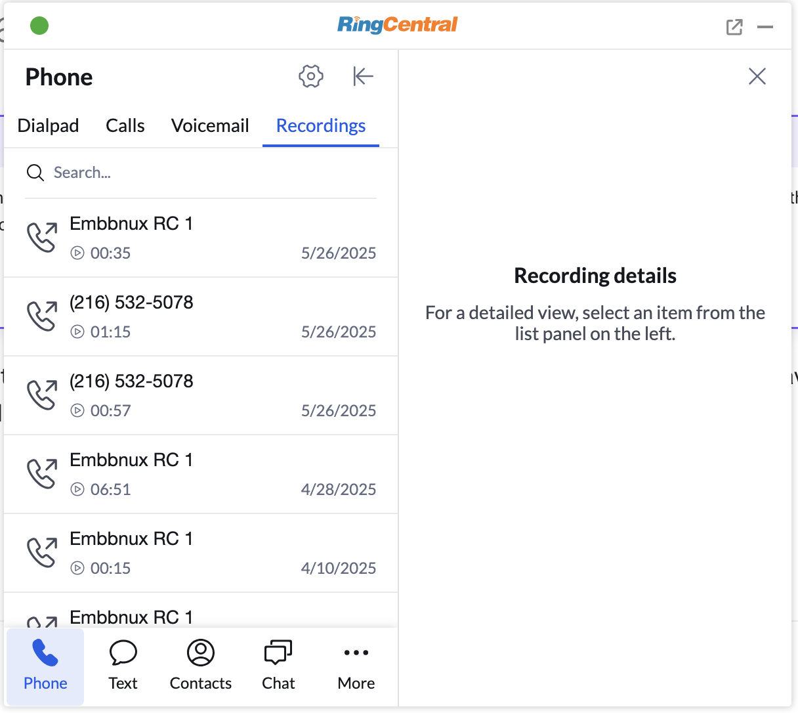

# Introducing RingCentral Embeddable 3.0

RingCentral Embeddable 3.0, marks the next generation of this popular RingCentral product, allowing developers to easily embed a RingCentral phone, SMS client, and more into any webpage or web application. 3.x aims to provide a better calling experience, and is currently in BETA.

!!! info "RingCentral Embeddable 3.0 is 100% backwards compatible for 2.x"

## What's new in 3.0

{class="float-end" style="max-width: 500px" align="right"}

**Side panel**

New the widget supports to extend the side panel to show more details without leaving the list page. Following details page are supported:

* Call recording page
* Voicemail details page
* SMS conversation page
* Fax details page
* Contact details page
* Chat conversation page
* Log call page
* Log messages page

**Call widgets**

Call Widgets are a powerful capability of RingCentral Embeddable, allowing developers to inject dynamic, contextual content directly into the core RingCentral calling experience.

When a user is on a call, call widgets appear in the right-hand panel, enabling quick access to relevant information or actions—without leaving the call page.

{style="max-width: 600px"}

Get more details about call widget in [call widget document](./integration/call-widget.md).

## Try it

Update your application to use the 3.x build:

=== "Javascript"

    Add following code to any website's header to embed a RingCentral phone into that page. 

    ```js
    <script>
      (function() {
        var rcs = document.createElement("script");
        rcs.src = "https://apps.ringcentral.com/integration/ringcentral-embeddable/3.x/adapter.js?clientId=YOUR_RINGCENTRAL_CLIENT_ID&enableSideWidget=1";
        var rcs0 = document.getElementsByTagName("script")[0];
        rcs0.parentNode.insertBefore(rcs, rcs0);
      })();
    </script>
    ```

=== "iframe"

    Add the following anywhere on your webpage.

    ```html
    <iframe width="300" height="500" allow="microphone" 
      src="https://apps.ringcentral.com/integration/ringcentral-embeddable/3.x/app.html?clientId=YOUR_RINGCENTRAL_CLIENT_ID&enableSideWidget=1">
    </iframe>
    ```

Then add following redirect URI into your app settings in RingCentral Developer Console:

```
https://apps.ringcentral.com/integration/ringcentral-embeddable/3.x/redirect.html
```
